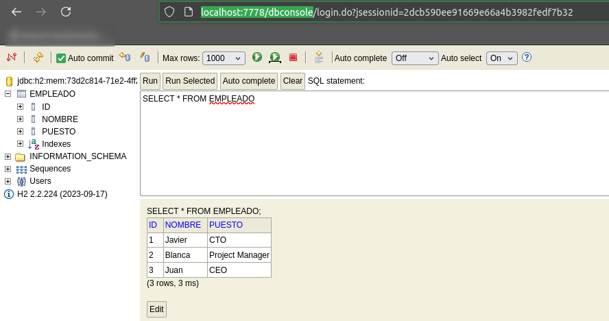

# CF-SpringBoot-Rest

Proyecto con Spring Boot utilizando Rest para hacer un CRUD de empleados y usar TDD

## H2 Base de datos

- Está configurado en spring sobre el fichero `src/main/resources/application.properties` de para que se pueda acceder a la consola gráfica de la base de datos

```ini 
spring.h2.console.enable=true
spring.h2.console.path=/dbconsole
```

- El path sería http://localhost:7778/dbconsole

